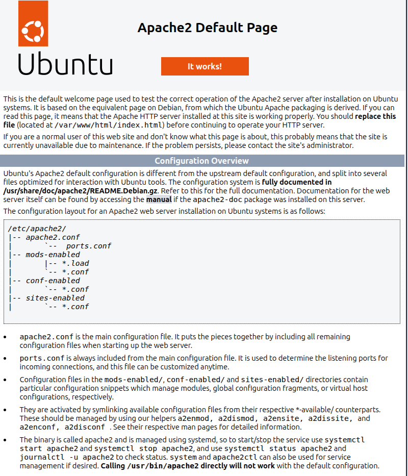
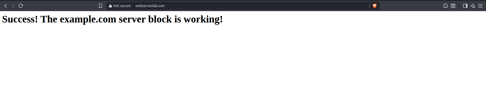
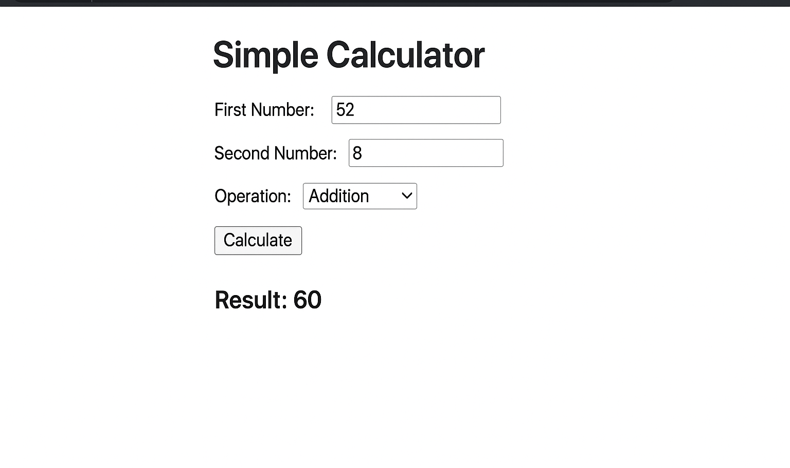
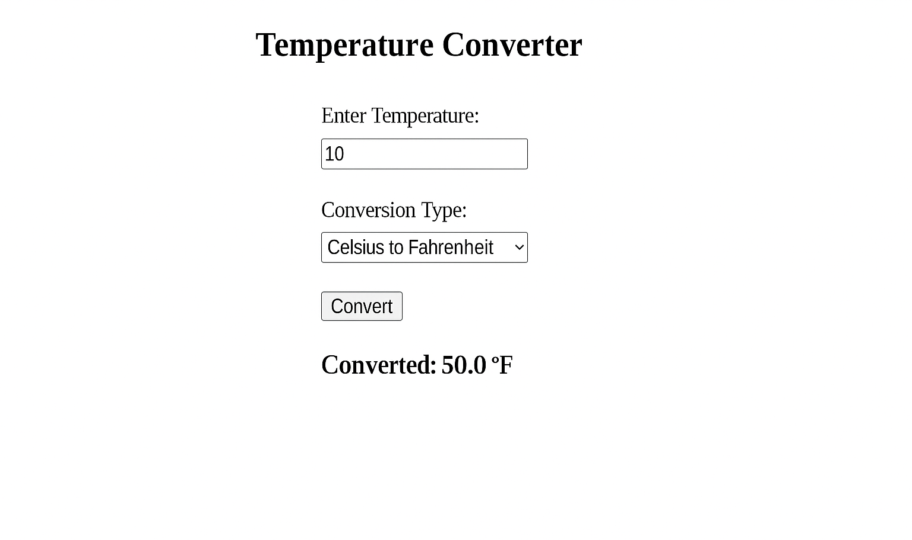

# Lab 1 Report: Apache Web Server Installation & Maintenance

---

## Table of Contents

1. [Introduction](#introduction)
2. [Task 1: Setting up an Apache Web Server](#task-1-setting-up-an-apache-web-server)
3. [Task 2: Setting up Virtual Hosts](#task-2-setting-up-virtual-hosts)
4. [Task 3: Hosting Dynamic Websites](#task-3-hosting-dynamic-websites)
5. [Important Apache Files and Directories](#important-apache-files-and-directories)
6. [Observations and Analysis](#observations-and-analysis)
7. [Conclusion](#conclusion)

---

## Introduction

This lab focuses on installing, administering, and maintaining an Apache web server on Ubuntu. Apache HTTP Server is one of the most widely-used web servers in the world and is essential for hosting websites. The lab objectives include:

- Installing and configuring Apache web server
- Understanding virtual hosts and hosting multiple domains
- Managing Apache services and processes
- Setting up dynamic websites using HTML and JavaScript
- Understanding Apache's directory structure and configuration files

Through this lab, we gain hands-on experience in web server administration, which is crucial for web engineering and system administration.

---

## Task 1: Setting up an Apache Web Server

### Step 1: Installing Apache

The first step was to install Apache web server using Ubuntu's package manager.

**Commands executed:**
```bash
sudo apt update
sudo apt install apache2
```

**Process:**
1. Updated the local package index to ensure we have the latest package information
2. Installed the `apache2` package along with all required dependencies
3. Apache was automatically started after installation

### Step 2: Adjusting the Firewall

Before testing Apache, we needed to configure the firewall to allow web traffic.

**Commands executed:**
```bash
sudo ufw app list
sudo ufw allow 'Apache'
sudo ufw status
```

**Process:**
1. Listed available UFW application profiles
2. Found three Apache profiles:
   - **Apache**: Opens only port 80 (HTTP)
   - **Apache Full**: Opens ports 80 (HTTP) and 443 (HTTPS)
   - **Apache Secure**: Opens only port 443 (HTTPS)
3. Enabled the 'Apache' profile to allow HTTP traffic on port 80
4. Verified the firewall configuration

**Result:** HTTP traffic was successfully allowed through the firewall.

### Step 3: Checking the Web Server

**Commands executed:**
```bash
sudo systemctl status apache2
```

**Process:**
1. Checked Apache service status using systemd
2. Verified that Apache was running successfully
3. Added domain mapping to `/etc/hosts`:
   ```
   127.0.0.1 webserverlab.com
   ```
4. Tested Apache by accessing:
   - `http://localhost`
   - `http://127.0.0.1`
   - `http://webserverlab.com`

### Checkpoint 1: Apache Installation Verification

**Objective:** Verify that Apache web server is installed and running correctly.

**Screenshots:**


*Figure 1: Apache default page accessed via localhost*


*Figure 2: Apache default page accessed via webserverlab.com domain*

**Observations:**
- Apache web server was successfully installed
- The service is running and responding to HTTP requests
- The default Apache landing page is displayed correctly
- Domain name mapping works correctly through `/etc/hosts`
- The page shows basic information about Apache configuration files and directories

**Status:** ✓ **Checkpoint 1 Completed (2 Marks)**

---

## Task 2: Setting up Virtual Hosts

### Step 1: Managing the Apache Process

We learned various Apache service management commands:

**Commands:**
```bash
sudo systemctl stop apache2      # Stop Apache
sudo systemctl start apache2     # Start Apache
sudo systemctl restart apache2   # Restart Apache
sudo systemctl reload apache2   # Reload configuration
sudo systemctl enable apache2    # Enable auto-start on boot
sudo systemctl disable apache2   # Disable auto-start on boot
```

### Step 2: Setting up a Single Virtual Host (example.com)

**Process:**

1. **Created directory structure:**
   ```bash
   sudo mkdir -p /var/www/example.com/html
   ```

2. **Set ownership:**
   ```bash
   sudo chown -R $USER:$USER /var/www/example.com/html
   ```

3. **Set permissions:**
   ```bash
   sudo chmod -R 755 /var/www/example.com
   ```

4. **Created index.html:**
   ```html
   <html>
   <head>
       <title>Welcome to Example.com!</title>
   </head>
   <body>
       <h1>Success! The example.com server block is working!</h1>
   </body>
   </html>
   ```

5. **Created virtual host configuration:**
   - File: `/etc/apache2/sites-available/example.com.conf`
   - Configuration:
   ```apache
   <VirtualHost *:80>
       ServerAdmin admin@example.com
       ServerName example.com
       ServerAlias www.example.com
       DocumentRoot /var/www/example.com/html
       ErrorLog ${APACHE_LOG_DIR}/error.log
       CustomLog ${APACHE_LOG_DIR}/access.log combined
   </VirtualHost>
   ```

6. **Enabled the virtual host:**
   ```bash
   sudo a2ensite example.com.conf
   ```

7. **Disabled default site:**
   ```bash
   sudo a2dissite 000-default.conf
   ```

8. **Tested configuration:**
   ```bash
   sudo apache2ctl configtest
   ```

9. **Restarted Apache:**
   ```bash
   sudo systemctl restart apache2
   ```

10. **Added domain to /etc/hosts:**
    ```
    127.0.0.1 example.com
    ```

### Checkpoint 2: Single Virtual Host Setup

**Objective:** Verify that the example.com virtual host is working correctly.

**Screenshot:**


*Figure 3: example.com virtual host displaying custom content*

**Observations:**
- Virtual host configuration was created successfully
- The virtual host is serving content from `/var/www/example.com/html`
- Custom HTML page is displayed correctly
- Domain name resolution works through `/etc/hosts`
- Apache is correctly routing requests to the appropriate virtual host

**Status:** ✓ **Checkpoint 2 Completed (5 Marks)**

### Checkpoint 3: Understanding Virtual Host Behavior

**Objective:** Understand what happens when accessing different domains and IP addresses.

**Process:**

1. **Re-enabled example.com virtual host:**
   ```bash
   sudo a2ensite example.com.conf
   sudo systemctl restart apache2
   ```

2. **Tested different access methods:**
   - `http://webserverlab.com`
   - `http://127.0.0.1`
   - `http://example.com`

**Screenshots:**


*Figure 4:*



*Figure 5:*

**Analysis:**

**What happened when accessing `http://webserverlab.com`:**
- Since the default site (000-default.conf) was disabled, Apache had no virtual host configured for `webserverlab.com`
- Apache uses the first available virtual host as the default when no matching ServerName or ServerAlias is found
- Therefore, `webserverlab.com` displayed the content from `example.com` virtual host
- This demonstrates Apache's fallback behavior when no specific virtual host matches

**What happened when accessing `http://127.0.0.1`:**
- Accessing via IP address (127.0.0.1) also showed the `example.com` content
- This is because:
  1. The default site was disabled
  2. Apache uses the first enabled virtual host as the default
  3. Since `example.com` was the only enabled virtual host, it became the default
  4. IP-based access doesn't match ServerName/ServerAlias, so it falls back to the default virtual host

**Key Understanding:**
- Virtual hosts are matched based on the `Host` header in HTTP requests
- When accessing by IP address, the Host header contains the IP, which doesn't match any ServerName
- Apache serves the first virtual host (in alphabetical order) when no match is found
- To serve different content for different domains, each domain needs its own virtual host configuration

**Status:** ✓ **Checkpoint 3 Completed (4 Marks)**

### Step 3: Setting up Multiple Virtual Hosts

**Process for anothervhost.com:**

1. **Created directory structure:**
   ```bash
   sudo mkdir -p /var/www/anothervhost.com/html
   sudo chown -R $USER:$USER /var/www/anothervhost.com/html
   sudo chmod -R 755 /var/www/anothervhost.com
   ```

2. **Created index.html with different content:**
   ```html
   <html>
   <head>
       <title>Welcome to AnotherVHost.com!</title>
   </head>
   <body>
       <h1>Success! The anothervhost.com server block is working!</h1>
       <p>This is a different virtual host with unique content.</p>
   </body>
   </html>
   ```

3. **Created virtual host configuration:**
   - File: `/etc/apache2/sites-available/anothervhost.com.conf`
   - Configuration:
   ```apache
   <VirtualHost *:80>
       ServerAdmin admin@anothervhost.com
       ServerName anothervhost.com
       ServerAlias www.anothervhost.com
       DocumentRoot /var/www/anothervhost.com/html
       ErrorLog ${APACHE_LOG_DIR}/error.log
       CustomLog ${APACHE_LOG_DIR}/access.log combined
   </VirtualHost>
   ```

4. **Enabled the virtual host:**
   ```bash
   sudo a2ensite anothervhost.com.conf
   sudo systemctl restart apache2
   ```

5. **Added domain to /etc/hosts:**
   ```
   127.0.0.1 anothervhost.com
   ```

### Checkpoint 4: Multiple Virtual Hosts Setup

**Objective:** Verify that multiple virtual hosts are working independently.

**Screenshot:**


*Figure 6: anothervhost.com virtual host displaying unique content*

**Observations:**
- Multiple virtual hosts are successfully configured
- Each virtual host serves its own unique content
- Domain-based routing works correctly
- Both `example.com` and `anothervhost.com` are accessible simultaneously
- Each virtual host has its own document root and configuration

**Test Results:**
- ✓ `http://example.com` → Shows example.com content
- ✓ `http://anothervhost.com` → Shows anothervhost.com content
- ✓ Both domains work independently without conflicts

**Status:** ✓ **Checkpoint 4 Completed (4 Marks)**

---

## Task 3: Hosting Dynamic Websites

### Objective

Create two dynamic websites using HTML and JavaScript, each with HTML forms that accept user inputs and use JavaScript to handle form submissions.

### Implementation

#### Website 1: example.com Dynamic Site

**Features:**
- HTML form with input fields
- JavaScript form validation and handling
- Dynamic content display based on user input

**HTML Structure:**
```<!DOCTYPE html>
<html>
<head>
  <title>Simple Calculator</title>
  <script>
    function calculate() {
      const num1 = parseFloat(document.getElementById("num1").value);
      const num2 = parseFloat(document.getElementById("num2").value);
      const operation = document.getElementById("operation").value;
      let result;

      if (isNaN(num1) || isNaN(num2)) {
        result = "Please enter valid numbers!";
      } else {
        switch (operation) {
          case "add": result = num1 + num2; break;
          case "subtract": result = num1 - num2; break;
          case "multiply": result = num1 * num2; break;
          case "divide": result = num2 !== 0 ? num1 / num2 : "Cannot divide by 0"; break;
        }
      }

      document.getElementById("result").innerText = "Result: " + result;
    }
  </script>
</head>
<body>
  <h2>Simple Calculator</h2>

  <form onsubmit="event.preventDefault(); calculate();">
    <label>First Number:</label>
    <input type="number" id="num1" required><br><br>

    <label>Second Number:</label>
    <input type="number" id="num2" required><br><br>

    <label>Operation:</label>
    <select id="operation">
      <option value="add">Addition</option>
      <option value="subtract">Subtraction</option>
      <option value="multiply">Multiplication</option>
      <option value="divide">Division</option>
    </select><br><br>

    <button type="submit">Calculate</button>
  </form>

  <h3 id="result"></h3>
</body>
</html>

```

#### Website 2: anothervhost.com Dynamic Site

**Features:**
- Different form structure with different fields
- JavaScript calculations or processing
- Unique dynamic functionality

**HTML Structure:**
```<!DOCTYPE html>
<html>
<head>
  <title>Temperature Converter</title>
  <script>
    function convertTemperature() {
      const temp = parseFloat(document.getElementById("temperature").value);
      const type = document.getElementById("type").value;
      let converted;

      if (isNaN(temp)) {
        converted = "Please enter a valid temperature!";
      } else {
        if (type === "CtoF") {
          converted = (temp * 9/5) + 32 + " °F";
        } else {
          converted = ((temp - 32) * 5/9).toFixed(2) + " °C";
        }
      }

      document.getElementById("output").innerText = "Converted: " + converted;
    }
  </script>
</head>
<body>
  <h2>Temperature Converter</h2>

  <form onsubmit="event.preventDefault(); convertTemperature();">
    <label>Enter Temperature:</label>
    <input type="number" id="temperature" required><br><br>

    <label>Conversion Type:</label>
    <select id="type">
      <option value="CtoF">Celsius to Fahrenheit</option>
      <option value="FtoC">Fahrenheit to Celsius</option>
    </select><br><br>

    <button type="submit">Convert</button>
  </form>

  <h3 id="output"></h3>
</body>
</html>

```

### Checkpoint 5: Dynamic Websites Deployment

**Objective:** Deploy two dynamic websites with HTML forms and JavaScript handling in separate virtual hosts.

**Screenshots:**







**Observations:**
- Both dynamic websites are successfully deployed
- HTML forms are functional and accept user input
- JavaScript successfully handles form submissions without page reload
- Each website has unique functionality:
  - **example.com**: Contact form with name, email, and message fields
  - **anothervhost.com**: Calculator with number inputs and operation selection
- Dynamic content is displayed based on user input
- No server-side processing required (pure client-side JavaScript)
- Forms validate input and provide immediate feedback

**Key Features Demonstrated:**
1. ✓ HTML form creation
2. ✓ JavaScript event handling (form submission)
3. ✓ Input validation
4. ✓ Dynamic DOM manipulation
5. ✓ Client-side processing
6. ✓ Multiple virtual hosts serving different dynamic content

**Status:** ✓ **Checkpoint 5 Completed (5 Marks)**

---

## Important Apache Files and Directories

### Content Directory

**`/var/www/html`**
- Default web root directory
- Contains the default Apache landing page
- Can be changed via Apache configuration

### Server Configuration

**`/etc/apache2/`**
- Main Apache configuration directory
- Contains all Apache configuration files

**`/etc/apache2/apache2.conf`**
- Main Apache configuration file
- Loads other configuration files
- Contains global Apache settings

**`/etc/apache2/ports.conf`**
- Specifies ports Apache listens on
- Default: port 80 (HTTP) and port 443 (HTTPS when SSL enabled)

**`/etc/apache2/sites-available/`**
- Directory for virtual host configuration files
- Contains all available site configurations
- Files must be enabled to be active

**`/etc/apache2/sites-enabled/`**
- Directory for enabled virtual hosts
- Contains symbolic links to files in `sites-available/`
- Apache reads configurations from this directory

**`/etc/apache2/conf-available/` and `/etc/apache2/conf-enabled/`**
- Directories for configuration fragments
- Not specific to virtual hosts
- Enabled/disabled with `a2enconf` and `a2disconf` commands

**`/etc/apache2/mods-available/` and `/etc/apache2/mods-enabled/`**
- Directories for Apache modules
- `.load` files load modules
- `.conf` files configure modules
- Enabled/disabled with `a2enmod` and `a2dismod` commands

### Server Logs

**`/var/log/apache2/access.log`**
- Records all HTTP requests to the web server
- Contains client IP, request method, URL, status code, etc.

**`/var/log/apache2/error.log`**
- Records all Apache errors
- Log level controlled by `LogLevel` directive
- Essential for troubleshooting

### Useful Commands

```bash
# Enable/disable sites
sudo a2ensite site-name.conf
sudo a2dissite site-name.conf

# Enable/disable modules
sudo a2enmod module-name
sudo a2dismod module-name

# Test configuration
sudo apache2ctl configtest

# View Apache status
sudo systemctl status apache2
```

---

## Observations and Analysis

### 1. Virtual Host Routing Mechanism

**Key Understanding:**
- Apache matches virtual hosts based on the `Host` HTTP header
- When a request arrives, Apache checks the `Host` header against `ServerName` and `ServerAlias` directives
- If no match is found, Apache serves the first virtual host (alphabetically) as the default
- IP-based access doesn't match any ServerName, so it uses the default virtual host

**Implications:**
- Each domain needs its own virtual host configuration for unique content
- The order of virtual hosts matters when no match is found
- Disabling the default site requires at least one virtual host to be enabled

### 2. Domain Name Resolution

**Process:**
- `/etc/hosts` file maps domain names to IP addresses locally
- This allows testing virtual hosts without DNS configuration
- Format: `IP_address domain_name`
- Multiple domains can map to the same IP (127.0.0.1)

**Use Case:**
- Essential for local development and testing
- Allows testing multiple domains on a single machine
- No need for actual DNS records during development

### 3. File Permissions and Ownership

**Requirements:**
- Web root directories need proper permissions (755 for directories, 644 for files)
- Ownership should allow the web server user (www-data) to read files
- Using `$USER:$USER` allows the current user to edit files while Apache can read them

### 4. Dynamic Website Implementation

**Client-Side vs Server-Side:**
- This lab used pure client-side JavaScript (no server processing)
- Forms are handled entirely in the browser
- No data is sent to the server
- Suitable for simple interactions and calculations

**Advantages:**
- Fast response (no server round-trip)
- Works without server-side scripting
- Reduces server load

**Limitations:**
- No data persistence
- No server-side validation
- Security concerns (client-side validation can be bypassed)

### 5. Apache Service Management

**Commands Learned:**
- `systemctl start/stop/restart/reload` - Service control
- `systemctl enable/disable` - Boot behavior
- `apache2ctl configtest` - Configuration validation
- `a2ensite/a2dissite` - Virtual host management

**Best Practices:**
- Always test configuration before restarting
- Use `reload` instead of `restart` when possible (avoids dropping connections)
- Enable sites explicitly rather than modifying default configuration

---

## Conclusion

This lab successfully demonstrated:

1. **Apache Installation and Configuration**
   - Successfully installed Apache web server
   - Configured firewall to allow web traffic
   - Verified Apache is running correctly

2. **Virtual Host Management**
   - Created and configured multiple virtual hosts
   - Understood virtual host routing mechanism
   - Successfully hosted multiple domains on a single server

3. **Dynamic Website Deployment**
   - Created dynamic websites with HTML forms
   - Implemented JavaScript form handling
   - Deployed websites in separate virtual hosts

4. **Apache Administration**
   - Learned Apache service management commands
   - Understood Apache directory structure
   - Familiarized with configuration files and logs

### Key Takeaways

1. **Virtual Hosts** enable hosting multiple websites on a single Apache server
2. **Domain-based routing** allows different content for different domains
3. **Client-side JavaScript** can handle form submissions without server-side processing
4. **Apache configuration** is modular and well-organized
5. **Service management** is crucial for web server administration

### Practical Applications

- **Web Development:** Understanding how web servers work is essential for web development
- **System Administration:** Apache administration skills are valuable for server management
- **Hosting Multiple Sites:** Virtual hosts enable cost-effective hosting of multiple websites
- **Local Development:** Setting up local development environments with custom domains

### Future Enhancements

- Implement server-side processing (PHP, Python, Node.js)
- Add SSL/TLS certificates for HTTPS
- Configure authentication and access control
- Set up reverse proxy configurations
- Implement load balancing

---


## Appendix

### A. Complete Virtual Host Configuration Example

```apache
<VirtualHost *:80>
    ServerAdmin admin@example.com
    ServerName example.com
    ServerAlias www.example.com
    DocumentRoot /var/www/example.com/html
    
    <Directory /var/www/example.com/html>
        Options Indexes FollowSymLinks
        AllowOverride All
        Require all granted
    </Directory>
    
    ErrorLog ${APACHE_LOG_DIR}/error.log
    CustomLog ${APACHE_LOG_DIR}/access.log combined
</VirtualHost>
```

### B. /etc/hosts Configuration

```
127.0.0.1       localhost
127.0.0.1       webserverlab.com
127.0.0.1       example.com
127.0.0.1       www.example.com
127.0.0.1       anothervhost.com
127.0.0.1       www.anothervhost.com
```

### C. Useful Apache Commands Cheat Sheet

```bash
# Service Management
sudo systemctl start apache2
sudo systemctl stop apache2
sudo systemctl restart apache2
sudo systemctl reload apache2
sudo systemctl status apache2

# Site Management
sudo a2ensite site-name.conf
sudo a2dissite site-name.conf

# Module Management
sudo a2enmod module-name
sudo a2dismod module-name

# Configuration
sudo apache2ctl configtest
sudo apache2ctl -S  # Show virtual host configuration

# Logs
sudo tail -f /var/log/apache2/error.log
sudo tail -f /var/log/apache2/access.log
```

---

**End of Report**

